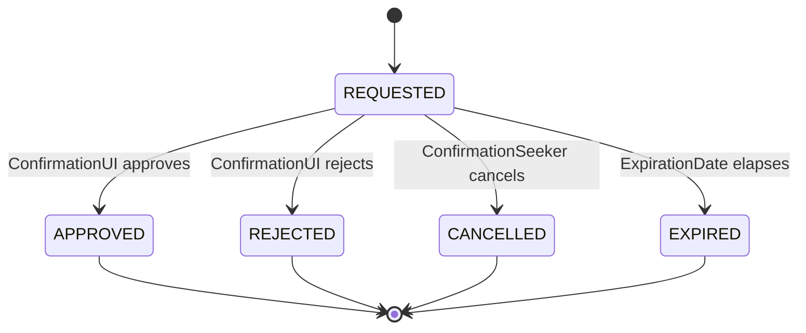
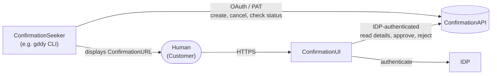
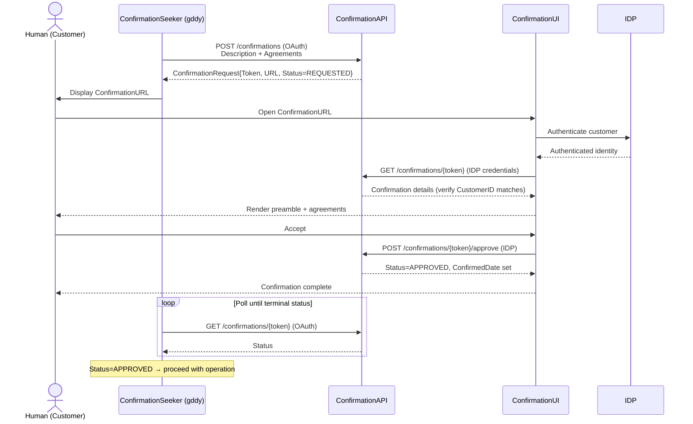
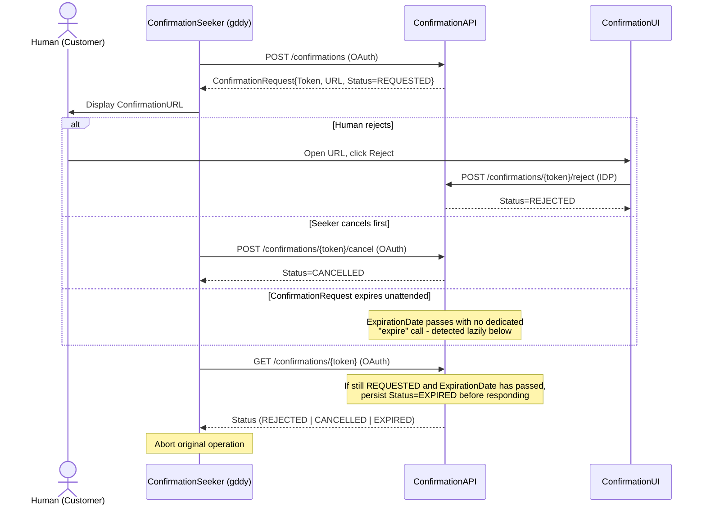

# Real Human Consent Proposal

## Problem statement

One goal of the GoDaddy CLI was to make it easy for humans to accomplish common GoDaddy tasks with the aid of assistive agents. While LLM-based agents can be prompted to control their behavior, this really only amounts to a suggestion. Even with the best of prompting, LLMs infamously ignore previously given instructions if the tokens bearing these instructions are not in the optimal high-attention location in their context window, and they can also erroneously use previously-given consent from a user as an excuse to authorize later operations.

So no matter how we design CLI command flags, no matter how we tailor LLM prompting in skills or embedded CLI help, we're never going to guarantee that users sufficiently consent to operations such as agreeing to terms & conditions or purchases.

## Proposal

To truly get users to agree to T&Cs, finalize purchase decisions, or other high-risk operations where we want to guarantee human consent, I'd like to propose a shared mechanism across the GoDaddy API landscape for demanding and fulfilling human consent.

### Concepts

The workflows in this document involve the following concepts.

#### ConfirmationRequest

A **ConfirmationRequest** is a persisted record consisting of:

- A **ConfirmationToken** - an opaque, unique, non-sequential, randomly-generated token used to identify the **ConfirmationRequest**.
- A **ConfirmationURL** - A URL pointing to the [**ConfirmationUI**](#confirmationui), embedding the **ConfirmationToken**.
- A **CustomerID** - the ID of the customer that we're seeking consent from. The **ConfirmationAPI** must derive or validate this against the calling **ConfirmationSeeker**'s credential at creation time - it cannot be an arbitrary value the seeker asserts - otherwise a request could later be approved for a customer the seeker was never authorized to represent.
- A **SeekerID** - an ID representing the [**ConfirmationSeeker**](#confirmationseeker); this could be, for example, the CLI's OAuth client ID. This identifies the calling *application*, not the specific user/account behind the credential, so it is not by itself sufficient to authorize status-check or cancellation calls; the **ConfirmationAPI** must still confirm that the caller's credential is bound to the **ConfirmationRequest**'s **CustomerID** before allowing access.
- A **Description** - a preamble about what the **ConfirmationRequest** is for, like "In order to register this domain, you must agree to the following."
- **Agreements** - a set of [**Agreement**](#agreement) records representing things that we wish the person to consent to.
- **Status** - an enumerated value indicating the state of the **ConfirmationRequest**. It can be `REQUESTED`, `APPROVED`, `REJECTED`, `CANCELLED`, or `EXPIRED`.
- **CreateDate** - The date/time the confirmation request was created.
- **ConfirmedDate** - A nullable date/time that indicates whether the user completed their confirmation and when they did so.
- **ExpirationDate** - The end date/time that the asked for confirmation remains valid; an expired **ConfirmationRequest** cannot be agreed to. This is set by the **ConfirmationSeeker** when it creates the **ConfirmationRequest**; there is no platform-wide default.
- **AuditData** - A JSON document of key/value pairs captured for non-repudiation purposes. This is kept as a flexible bag of fields, rather than a fixed schema, so that what's collected can evolve over time. The first draft would include things like the IP address, user agent, and IDP session details of the approving/rejecting request.

**Status** follows a simple lifecycle. `APPROVED`, `REJECTED`, `CANCELLED`, and `EXPIRED` are all terminal; a **ConfirmationRequest** cannot be re-approved, re-rejected, or reopened once it leaves `REQUESTED`.

Each transition out of `REQUESTED` must be applied as an atomic compare-and-set against the persisted status, not a blind write: an approve, reject, or cancel only succeeds if the stored status is still `REQUESTED`, and a request that loses that race receives back whichever terminal status was already recorded. This prevents, for example, an approval and a cancellation racing to overwrite one another. There is no separate "expire" operation in the **ConfirmationAPI**; instead, `ExpirationDate` is part of that same atomic predicate rather than a separate lazy check layered on top - an approve or reject only succeeds if the stored status is `REQUESTED` **and** `ExpirationDate` has not yet passed, evaluated together in the one transition. This closes the race where an approval reads `REQUESTED` just before expiry but would otherwise win the status-only compare-and-set just after it: any transition attempt (or plain read) against a `REQUESTED` request whose `ExpirationDate` has already passed instead persists and returns `EXPIRED`.

#### Agreement

An **Agreement** is a standalone item we are entering into a contract with a customer over. It is made up of:

- **ConfirmationToken** - reference to the encompassing **ConfirmationRequest** record that this agreement is a part of. This can be omitted if we store agreements as embedded data rather than in their own table.
- An **AgreementType** - an enumerated set of "flavors" of agreements, for example `TERMS_AND_CONDITIONS` or `PURCHASE`. Each **AgreementType** has an associated JSON schema that **AgreementData** must conform to.
- **AgreementData** - a JSON document, conforming to the schema of a given **AgreementType**. This JSON is used for rendering the UI that a user sees when they're being asked to confirm an operation. For `TERMS_AND_CONDITIONS`, this may involve a URL containing text that we want the user to read and agree to abide by; because the content behind a live URL can change or disappear after the fact, the schema must also capture an immutable snapshot (or at least a content hash) of what was actually rendered and accepted, and treat the URL as a display link rather than the record of consent. For `PURCHASE`, the data may include an itemized breakdown of all charges included in a purchase.

#### ConfirmationSeeker

A **ConfirmationSeeker** is an interface that wants to acquire consent from a human. It is responsible for assembling the contents of a [**ConfirmationRequest**](#confirmationrequest) and checking for its human acceptance or rejection. A **ConfirmationSeeker** is the holder of an OAuth token or PAT that authorizes it as a representative for performing actions on a user's behalf.

An `APPROVED` **ConfirmationRequest** is only meaningful if the operation it authorizes is the operation that actually runs. A **ConfirmationSeeker** must therefore include enough detail in its **Agreements** - an immutable operation identifier, or a digest of the operation's key parameters - to bind the approval to one specific operation, and must re-verify that binding before executing anything on the strength of an `APPROVED` status. Otherwise, approval collected for one description of an operation could be reused to justify a different one.

`APPROVED` is also a durable status that stays queryable indefinitely, not a one-time signal, so a **ConfirmationSeeker** must not treat "I observed `APPROVED`" as license to run the operation as many times as it happens to check. A timed-out command that retries, or two processes polling the same **ConfirmationRequest**, must not be able to execute the same approved operation twice. This cannot be left to the downstream operation's own idempotency, since not every purchase or mutation is naturally idempotent; a mandatory, atomic single-claim mechanism - keyed by the **ConfirmationToken** or the bound operation identifier, with the claim itself an atomic compare-and-set that only one caller can win - is required so that repeated observations of `APPROVED` result in at most one execution.

This proposal is meant to be flexible enough for reuse in various situations, but the first implemented holder of this role would be the `gddy` CLI.

#### ConfirmationAPI

The **ConfirmationAPI** is a RESTful API for managing a [**ConfirmationRequest**](#confirmationrequest). It has two users:

- The [**ConfirmationSeeker**](#confirmationseeker), calling with OAuth credentials
- The [**ConfirmationUI**](#confirmationui), calling with IDP (pass-through customer identity) credentials

The following operations are supported:

| Operation | User |
|-----------|------|
| **Creating a confirmation** | **ConfirmationSeeker** |
| **Cancelling a confirmation** | **ConfirmationSeeker** |
| **Checking a confirmation status** | **ConfirmationSeeker** |
| **Reading confirmation details** (preamble + agreements, for rendering) | **ConfirmationUI** |
| **Approving a confirmation** | **ConfirmationUI** |
| **Rejecting a confirmation** | **ConfirmationUI** |

By separating out the authentication models for these operations, we ensure that an agent working on behalf of a human (through OAuth credentials) cannot approve an operation by itself; approval requires an IDP-authenticated customer session acting within the [**ConfirmationUI**](#confirmationui). This guarantees the approving party is authenticated *as* the customer; it is a lesser guarantee than proof that a live human, rather than an automated agent driving an already-authenticated browser session, clicked the button - see the note on the [**ConfirmationUI**](#confirmationui) below.

#### ConfirmationUI

The **ConfirmationUI** is an HTML interface, accessible over HTTPS, where a customer can:

- Read the preamble
- See details on each thing they're agreeing to (T&Cs, price breakdowns)
- Click a button to accept or reject

The UI is reachable via a URL carrying the **ConfirmationToken**. The UI is responsible for:

- Demanding user authentication (IDP auth), redirecting if they aren't authenticated
- Authorizing access only if an authenticated customer is the same customer related to the **ConfirmationToken** - as a UX convenience only. The real authorization boundary is the **ConfirmationAPI** itself: it must independently validate the IDP assertion on every detail-read, approve, and reject call and reject any request whose customer subject doesn't match the **ConfirmationRequest**'s **CustomerID**, since anti-CSRF checks alone authenticate the browser request, not the identity behind it, and the UI's own check can be bypassed by a caller that talks to the **ConfirmationAPI** directly
- Reading the [**ConfirmationRequest**](#confirmationrequest) details from the **ConfirmationAPI** and reflecting its current status (letting them know if they already agreed to or rejected the confirmation request)
- Rendering the confirmation details, treating the **Description** and **AgreementData** it receives from the **ConfirmationAPI** as untrusted, seeker-supplied content - rendered with contextual escaping against a data-only schema (no raw HTML/script), and with any embedded URLs validated against a safe scheme/host allowlist before being made clickable
- Allowing the user to accept or reject the **ConfirmationRequest** as a whole - all of its **Agreements** together. Partial acceptance of individual agreements is not supported.
- Calling the **ConfirmationAPI** to record acceptance/rejection, with anti-CSRF protection (an anti-CSRF token plus Origin/Referer validation) on that call so a third-party site cannot forge an approval/rejection using the customer's authenticated session

This UI cannot be accessed with OAuth credentials or a PAT; interaction requires an IDP-authenticated customer session. That proves the actor is authenticated as the customer, not that a live human (rather than an automated agent driving an already-authenticated browser session) performed the click - this proposal does not include a proof-of-presence mechanism (e.g. a WebAuthn user-presence assertion). That is a candidate for future work and out of scope here.

### Flow

These sequence diagrams summarize the interactions.

#### Requesting and approving a ConfirmationRequest

#### Rejection, cancellation, and expiration

## Rejected alternatives

- **Popup confirmations** - displaying pop-up windows on the user's machine was considered. This would be an expensive solution, requiring cross-platform interactions with various OS UI platforms. Compatibility is difficult, especially with the Linux platform which is highly variable. Also, this confirmation system is flexible enough to be usable in other contexts, such as MCP servers seeking human confirmation.
- **Agent prompts** - as stated in the problem statement, we can only ever make a best effort that we request agents to seek human consent; this has proven to be insufficient.
