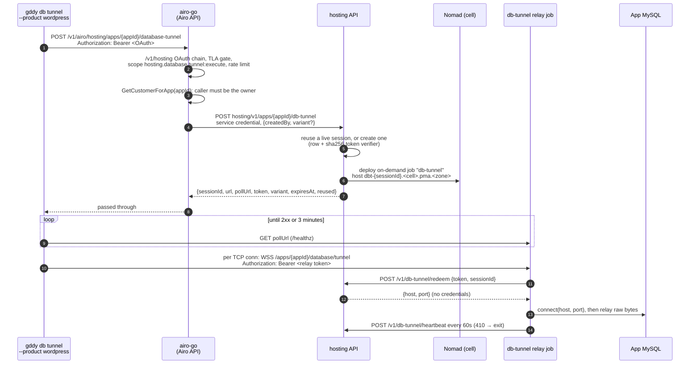

# Proposal: `gddy db tunnel --product wordpress` — MySQL access for Managed WordPress

Status: draft. The CLI, airo-go, and hosting changes are implemented but not
merged. Open work, blockers, and their current state are tracked in
`mhp-core/docs/db-tunnel-on-demand-followups.md`. This document describes the
design only.

This document covers only what differs for Managed WordPress (product `mwp`,
product app type `mhwp`). The WebSocket protocol, bind safety, events, and the
MySQL security model are the same as for Node.js Hosting; see
[db-tunnel.md](./db-tunnel.md).

## Motivation

`gddy db tunnel` gives a developer a local MySQL port that relays to an app's
database over a WebSocket. For Node.js Hosting apps, the far end is the app's
long-running **agent**. Managed WordPress apps have no agent: the
`managed-wordpress` composition runs no agent task and defines no `agent` URL.
Running one for the full life of every site only to serve an occasional tunnel
is wasteful.

Instead, hosting starts a small **on-demand relay job** when a tunnel is
requested, in the same way it starts phpMyAdmin (`pma`) sessions. The relay
speaks the same WebSocket protocol as the agent, so the CLI relay code is
shared.

## Design decisions

| Decision | Chosen | Rejected, and why |
| --- | --- | --- |
| What serves the WebSocket | An on-demand `db-tunnel` Nomad job per session, deployed through hosting's existing on-demand job framework (`onDemandJobs` in the composition) | An agent task or sidecar in the main `managed-wordpress` job: it would run for the full life of every site. |
| How the CLI gets a token | hosting mints a relay session token. airo-go only authorizes and proxies. | A hosting mint of an airo-builder agent token (cert2s delegation plus `X-OAuth-Token`): there is no agent to accept it. This design was built and reverted. |
| How MySQL is reached | The relay dials the database host and port that hosting returns. MySQL credentials never leave the database. | Going through the phpMyAdmin proxy: that gives a web console, not a MySQL port. |
| Session sharing | One live session per app, cell, and variant is reused, and every mint gets a fresh token | A new job per CLI run: it starts slowly and wastes resources on reconnects. |
| Token storage | Only a sha256 verifier is stored. The token is bound to one session. | Plaintext tokens, or tokens valid for any session: a leaked row, or a token from one relay, could open another. |
| Infrastructure | Phase 1 reuses the phpMyAdmin DNS zone, Nomad namespace, and hosting API base URL (see **Phase 1 shortcuts**) | New ones now: that needs DNS, Nomad, and config work before the first tunnel. |
| Image ownership | Pioneer images builds the relay image, alongside the phpMyAdmin image. It is registered per app with the same mechanism. | — |

## How it works

- **Control plane.** One HTTPS call when the command starts, to the **Airo API**
  (airo-go). airo-go checks the caller and asks hosting for a relay session.
  Hosting creates the session and schedules the relay job, or reuses a live
  session.
- **Readiness.** A new relay needs time to be scheduled and routed. The CLI polls
  the session's `pollUrl` until it answers, for at most 3 minutes, before it opens
  the local port.
- **Data plane.** One WebSocket per local TCP connection, straight from the CLI
  to the relay, carrying raw MySQL bytes. It never touches airo-go or hosting.



### Step by step

1. **CLI.** `--product wordpress` calls
   `HostingClient::ensure_airo_database_tunnel_session`, which sends
   `POST {api base}/v1/airo/hosting/apps/{appId}/database-tunnel` with the CLI's
   OAuth token. The token has the same scopes as for Node.js: deploy-execute and
   `hosting.database.tunnel:execute`. The response body is not logged, because
   it contains the relay token.
2. **airo-go: authenticate, scope, rate limit.** The route is on airo-go's
   public `/v1/hosting` group, which accepts only an Authorization Platform
   OAuth access token. The token must carry `hosting.database.tunnel:execute`,
   so deploy authority alone is not enough. At most 10 requests per minute
   with a burst of 5 are allowed per app and customer.
3. **airo-go: ownership.** airo-go looks up the customer who owns the app, and
   the caller must be that customer. An unknown app, a failed lookup, or
   another customer's app all get the same `404 app not found`. Collaborators
   are not resolved on this path.
4. **airo-go → hosting.** airo-go calls hosting's
   `POST hosting/v1/apps/{appId}/db-tunnel` with its service credential and no
   `X-On-Behalf-Of`. The body carries only attribution (`createdBy`) and an
   optional `variant` (`publish` or `staging`). `force` is never forwarded.
5. **hosting: session.** hosting refuses an app with no database. It reuses a
   live session in the same cell and variant when at least 15 minutes of its
   1-hour lifetime remain, and mints a fresh token for it. Otherwise it creates
   a session and deploys the `db-tunnel` on-demand job. Only a sha256 verifier
   of the token is stored.
6. **Relay.** The relay redeems the token for its own session only, and gets
   back the database host and port, never credentials. MySQL authentication and
   TLS stay end to end between the client and the database. The relay
   heartbeats while it runs. If a heartbeat returns `410`, the session is gone
   and the relay exits.
7. **Teardown.** Sessions end when they expire, when the relay stops
   heartbeating, or when the app is torn down, archived, or moved. hosting
   revokes the tokens, marks the session stopped, and stops the Nomad job. A
   sweep command (`db-tunnel-session-sweep`) cleans up leftovers.

### Session lifecycle

| Setting | Value | Effect |
| --- | --- | --- |
| Session lifetime | 1 hour | The token and the session expire together. The CLI does not renew them. |
| Reuse window | at least 15 minutes left | A mint reuses a live session only if it has at least this long left. Otherwise it starts a new one. |
| Heartbeat interval | 60 seconds | How often the relay reports that it is alive. |
| Liveness timeout | 5 minutes | With no heartbeat for this long, the session counts as dead: redeem answers `410` and it is not reused. |
| Startup grace | 3 minutes | A new session counts as alive before its first heartbeat for this long. The CLI's readiness wait uses the same limit. |
| Sweep grace | 15 minutes past expiry | The sweep stops sessions older than this, up to 200 per run. |

## Command surface

This adds one flag to the flags in [db-tunnel.md](./db-tunnel.md#command-surface):

| Flag | Required | Default | Purpose |
| --- | --- | --- | --- |
| `--product <PRODUCT>` | no | `nodejs` | Selects the service that mints the tunnel token: `nodejs` uses the Node.js Hosting API, `wordpress` uses the Airo API. Any other value is rejected by the argument parser. |

```console
$ gddy db tunnel --app-id <app-id> --product wordpress
$ mysql --ssl-mode=REQUIRED -h 127.0.0.1 -P 3306 -u <user> -p
```

For WordPress, the event stream has an extra `provision` step between
`authorize` and `listening` while the CLI waits for the relay.

## Authentication and authorization

| Layer | Check | Failure |
| --- | --- | --- |
| airo-go | The OAuth JWT is valid (`/v1/hosting` chain) | `401` (`503` if the signing keys are unavailable) |
| airo-go | The customer has a shopper ID and passes the TLA gate | `403` |
| airo-go | The token has the scope `hosting.database.tunnel:execute` | `403 Insufficient scope` |
| airo-go | Rate limit per app and customer | `429` |
| airo-go | The caller is the app's owner | `404 app not found` |
| hosting | The service credential is allowed (`JWTOrCert`: Airo console or CTK cert) | airo-go answers `502` |
| hosting | The app exists and owns a database | `409` |
| relay → hosting | The token is live and belongs to the relay's own session | `401`, or `410` when the session is gone |
| MySQL | The database user's own password, `GRANT`s, and TLS, end to end | a MySQL error |

The CLI also refuses a `pollUrl` that is not `https` or not on the relay's own
host.

## Phase 1 shortcuts

These reuse phpMyAdmin infrastructure and are marked with TODOs in the hosting
code:

- **DNS.** The relay's hostname is under the phpMyAdmin wildcard zone
  (`dbt-{sessionId}.<cell>.pma.<zone>`). It should move to its own zone.
- **Nomad namespace.** The relay job runs in the `phpmyadmin` namespace. It
  should get its own.
- **API base URL.** The relay reaches hosting through the same base URL that
  phpMyAdmin uses.

## Ownership

| Owner | Part |
| --- | --- |
| CLI | `--product wordpress`, the session mint call, and the readiness poll |
| airo-go | `POST /v1/hosting/apps/:appId/database-tunnel` on the `/v1/hosting` OAuth chain: scope, rate limit, owner check, and a proxy to hosting. Also wiring that chain in production. |
| hosting | Session tables, the session service, the mint, redeem, heartbeat, and stop routes, the `db-tunnel` job template, teardown, and the sweep command |
| hosting operations | Registering the relay image per environment and scheduling the sweep |
| pioneer images | The relay image, built to the **Relay contract** |

The state of each part is in `mhp-core/docs/db-tunnel-on-demand-followups.md`.

## Hosting API

| Route | Caller | Auth | Answer |
| --- | --- | --- | --- |
| `POST /hosting/v1/apps/:id/db-tunnel` | airo-go, support tools | `JWTOrCert` (Airo console or CTK cert) | `200 {sessionId, domain, url, pollUrl, token, variant, expiresAt, reused}`. `400` for a bad request, `409` for no database, `503` when not configured or the cell is unreachable. |
| `POST /hosting/v1/apps/:id/db-tunnel/stop` | support tools | `JWTOrCert` | `200 {stopped, failed}`, or `204` if nothing was live |
| `POST /hosting/v1/db-tunnel/redeem` | relay | the session token in the body | `200 {sessionId, appId, variant, host, port, expiresAt}`. `401` for a bad token, `410` when the session is gone. |
| `POST /hosting/v1/db-tunnel/heartbeat` | relay | the session token in the body | `200 {ok: true}`. `401` for a bad token, `410` when the session is gone. |

## Relay contract

The relay image must:

- Listen on port `8080`. Answer `GET /healthz` with `200` once it can take
  tunnels.
- Accept `GET /apps/{APP_ID}/database/tunnel` as a WebSocket upgrade with
  `Authorization: Bearer <token>`. Relay binary frames to and from MySQL
  exactly like the Node.js agent, with frames of up to 32 MiB.
- Redeem each presented token with `POST {HOSTING_DB_TUNNEL_API}/v1/db-tunnel/redeem`
  and the body `{"token": "...", "sessionId": "<DB_TUNNEL_SESSION_ID>"}`. Dial
  the `host:port` it returns. Refuse the WebSocket on `401` or `410`.
- Send `POST {HOSTING_DB_TUNNEL_API}/v1/db-tunnel/heartbeat` with the same body
  every 60 seconds. Exit on `410`.
- Never log tokens, and never receive or log database credentials.
- Run with a read-only root filesystem, all capabilities dropped,
  `no-new-privileges`, and a 16 MB `/tmp`, within 64 MHz of CPU and 128 MB of
  memory.

The job sets `APP_ID`, `DOM_ID`, `DB_TUNNEL_DOMAIN`, `DB_TUNNEL_SESSION_ID`,
`DB_TUNNEL_VARIANT`, `HOSTING_DB_TUNNEL_API`, `PORT`, `REGION`, `SERVER_ENV`,
and `IMAGE`.

## Limitations

- **Owner only.** Collaborator grants are not resolved on the OAuth path.
- **No renewal.** New connections fail once the 1-hour session ends. Run the
  command again to get a new session.
- **Publish only from the CLI.** airo-go and hosting accept `staging`, but the
  CLI has no `--variant` flag yet.
- **Idle relays.** A relay stays up until its session expires, even after the
  CLI exits, because concurrent tunnels can share a session.

## Testing

- **CLI.** `rust/src/db/tunnel.rs` covers the product flag, parsing both mint
  response shapes, and the `pollUrl` checks. `rust/src/hosting/client_tests.rs`
  covers the request path, the Bearer header, and the parsed response.
- **airo-go.** `handlers/database_tunnel_proxy_handler_test.go` covers the owner
  check, the same 404 for every miss, variant forwarding and validation, status
  mapping, and, through the real `/v1/hosting` chain, registration, `401`,
  scope `403`, and the rate limit.
- **hosting.** The service, sweep, handler, router, and template render tests
  (`db_tunnel_*_test.go`, `managed_wordpress_db_tunnel_job_test.go`).
- **End to end.** Not run yet. See the follow-up doc for what it is waiting on.
