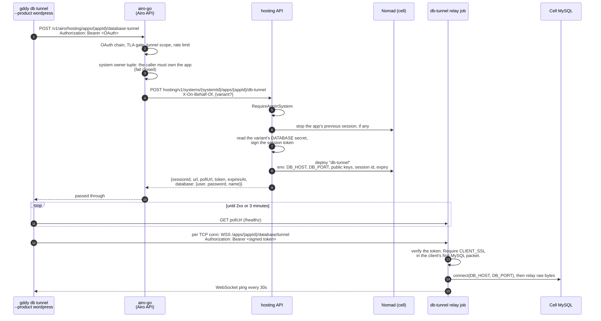

# Proposal: `gddy db tunnel --product wordpress` — MySQL access for Managed WordPress

Status: draft, revised after the design review of 2026-10-02 (see **Review
response**).

- **Phase 1 is scoped so that it needs no new capability and no cross-team
  design decision:** owner only, one session per app, and WordPress's own
  database user.
- What phase 1 leaves out on purpose, the risk each choice carries, and what to
  do if security does not accept it are in **Deferred on purpose**.
- Phase 1 is implemented on the branches as of 2026-10-05 (hosting, airo-go,
  and the CLI), and not committed yet. **Changes from the first design** lists
  what changed. The relay image is not built yet.
- Open work is tracked in `mhp-core/docs/db-tunnel-on-demand-followups.md`.

This document covers only what differs for Managed WordPress (product `mwp`,
product app type `mhwp`). The WebSocket protocol and bind safety are the same as
for Node.js Hosting; see [db-tunnel.md](./db-tunnel.md). The security model is
**not** the same: see **TLS to MySQL**.

## Motivation

`gddy db tunnel` gives a developer a local MySQL port that relays to an app's
database over a WebSocket. For Node.js Hosting apps, the far end is the app's
long-running **agent**. Managed WordPress apps have no agent. Running one for
the full life of every site only to serve an occasional tunnel is wasteful.

Instead, hosting starts a small **on-demand relay job** for a tunnel session, as
it does for phpMyAdmin (`pma`) and SSH sessions. The relay speaks the same
WebSocket protocol as the agent, so the CLI's relay code is shared.

## Phase 1 scope

| Topic | Phase 1 | Why this choice |
| --- | --- | --- |
| Who | The app's owner only | The OAuth path names a customer. Collaborator grants are not resolved on it. |
| Sessions | **One live session per app.** A new mint stops the app's previous session and starts a new one ("newest wins"). | Hosting cannot read a job's state, so reuse would need liveness reports. This needs none. |
| Credentials | **WordPress's own database user** for the variant, read by hosting from that variant's `DATABASE` secret and returned once in the mint response | hosting already does this read for phpMyAdmin. A user per session needs DDL on cell MySQL, which nothing in mhp-core can do today. |
| Relay token | A hosting-signed token that the relay checks itself. No hosting routes for the relay. | It avoids two workload-callback routes that would need an argued exception (F1). It is self-contained in hosting. |
| TLS to MySQL | **Enforced by the relay**: it closes a connection whose client does not ask for TLS | The server cannot enforce it, and TLS cannot be required on WordPress's user (F11). |
| Infrastructure | phpMyAdmin's DNS zone, Nomad namespace, SELinux type, and Cilium policy | These are proven by the proof of concept, and already installed in production. |
| Variant | `publish` from the CLI. The API also accepts `staging`. | It keeps the CLI surface small. |

## Proof of concept

On 2026-10-02 and 2026-10-05, the reviewer opened MySQL sessions to a test site
on dev cell c10 through a stand-in relay. The stand-in was `websocat`, running
in a throwaway Nomad job, `dbt-poc`, in the `phpmyadmin` namespace. It did not
exercise the mint, tokens, or the CLI. The procedure is in the design review.

- **Path:**

  ```text
  mysql client ─TCP─► gddy CLI ─WSS─► Cloudflare ─HTTPS─► v2-ingress-proxy ─HTTP:80─► relay ─TCP─► cell MySQL
  ```

  `v2-ingress-proxy` runs in the `ingress` namespace and finds backends from
  their `ingress.domains=Host(...)` service tags. WebSockets are on for every
  cell zone in Cloudflare, in dev and production.
- **Worked:**
  - A login as the site's database user, with TLS 1.3.
  - An 8 MiB row, a 50 MB result set (about 17 MB/s), and `mysqldump`.
  - `label=type:pma_workloads.process` on port `80`, running as uid 65534 with
    every capability dropped and a read-only root.
- **Failed:**
  - Port `8080`. SELinux denies the bind, and the `phpmyadmin` Cilium policy
    admits only TCP 80.
  - A silent tunnel. It was cut between 5 and 11 minutes. A ping every 30
    seconds kept it open for 11 minutes.
- **Server settings found:**
  - `require_secure_transport` is `0` on every MySQL server, in dev and in all
    production series.
  - `wait_timeout` is 60 seconds on c10.
  - `max_allowed_packet` is 16 MiB.

## How it works



### Step by step

1. **CLI.** It sends `POST {api base}/v1/airo/hosting/apps/{appId}/database-tunnel`
   with an OAuth token scoped to deploy-execute and
   `hosting.database.tunnel:execute`. The response is not logged, because it
   holds the token and a database password.
2. **airo-go: authenticate.** The route is on the public `/v1/hosting` group:
   an Authorization Platform OAuth token only, the TLA gate, the tunnel scope,
   and 10 requests per minute per app and customer. The limiter is per process,
   so it is an abuse brake, not a quota.
3. **airo-go: tenancy.** airo-go reads the app's `systemId`, then that
   system's owner tuple from hosting. If the owner type is not
   `airoSubscriptionId`, it **fails closed**. Nothing on the app record is
   trusted for ownership: there is no fallback to `variables.airoSubscriptionId`
   (F7). The subscription's customer must be the caller. Every miss, and every
   lookup error, answers `404 app not found`.
4. **airo-go → hosting.** It calls the **tenancy-scoped** route
   `POST hosting/v1/systems/{systemId}/apps/{appId}/db-tunnel` with
   `X-On-Behalf-Of: customer:<id>`, so hosting checks `RequireAppInSystem` too
   (F7). The body carries only `variant` (`publish` or `staging`). Attribution
   comes from `X-On-Behalf-Of`. It never carries `force`. The response is
   relayed unchanged, with `Cache-Control: no-store`.
5. **hosting: session.**
   - hosting refuses an app with no database for the variant (`409`).
   - It checks everything that cannot change state first: the variant, the
     database, the credentials, the cell, and the relay hostname. A mint that
     would fail does not cost the caller the tunnel they already have.
   - It reads the variant's credentials the way phpMyAdmin does
     (`loadVariantDbCredentials`, shared by both): coordinates from the
     variant's `hosting_databases` row, and the user, password, and schema from
     the variant's own `DATABASE` secret if it `OwnsOwnDatabase()` (staging),
     or from the shared one (publish).
   - It stops the app's previous session, if one is live, and reports
     `replaced: true`. If that stop cannot be sent, the mint fails with `503`
     and the previous tunnel stays.
   - It creates the session row, signs the token, and deploys the relay job.
     The job's environment holds no secret. One live row per app is enforced
     by a unique key, so of two mints at the same instant one wins and the
     other gets `409`.
6. **CLI: wait and listen.** The CLI polls `pollUrl` for up to 3 minutes. It
   then writes the credentials to a mode-600 MySQL option file in a mode-700
   temporary directory, and prints the
   `mysql --defaults-extra-file=… --ssl-mode=REQUIRED` command to use. The
   file sets `user`, `password`, `host`, `port`, and `protocol=TCP` under
   `[client]`, and `database` under `[mysql]`, so `mysqldump` can use it too.
   The file is deleted when the command exits; a killed process leaves it in
   the user's temporary directory. The password is never printed or put in an
   event. If `replaced` is true, the CLI warns that the previous tunnel was
   closed.
7. **Relay.** For each WebSocket, it verifies the token: the signature, the
   audience, the expiry, `sessionId == DB_TUNNEL_SESSION_ID`, and
   `appId == APP_ID ==` the path's app id. It dials `DB_HOST:DB_PORT`. It
   closes the connection if the client's first MySQL packet does not ask for
   TLS. It pings every 30 seconds.
8. **End.** The relay exits on its own when it has had no connection for 10
   minutes, or at expiry (see **Expiry**). hosting stops the job when:
   - a new session replaces it;
   - the session is stopped;
   - the app is torn down, archived, or moved to another system or owner;
   - the sweep finds the session expired.

### Expiry

| Setting | Value | Effect |
| --- | --- | --- |
| Session lifetime | 1 hour | The token expires. The relay refuses new connections from then on. |
| Drain | up to 15 minutes after expiry | Connections that are already open keep running, so a `mysqldump` that started near the end is not cut (F6). Then the relay exits. |
| Idle exit | 10 minutes without an open connection | The relay exits. MySQL closes idle sessions after `wait_timeout` (60 seconds on c10) anyway, and the `mysql` client reconnects on its own. |
| Sweep | 15 minutes after the drain ends | Stops jobs that neither the relay nor a stop hook cleaned up |

A stop for a replacing mint, teardown, archive, or a system move does not wait
for the drain. It cuts open connections at once.

## TLS to MySQL

There are two layers of encryption, and only one is end to end:

- **The WebSocket's TLS is hop by hop.** Cloudflare decrypts it to proxy it, and
  `v2-ingress-proxy` decrypts it again. The last hop, from the ingress to the
  relay, is plain HTTP on port 80. The token in the `Authorization` header is
  readable at each of these.
- **MySQL's own TLS**, negotiated by the client and the server inside the
  tunnel, is end to end. It is the only layer that protects queries and
  results.

The server cannot be the backstop:

- `require_secure_transport` is `OFF` on every MySQL server, in dev and
  production.
- It cannot be turned on: WordPress on these cells connects without TLS (no
  `MYSQL_CLIENT_FLAGS`), so every site on the server would be cut off.
- `REQUIRE SSL` cannot be set on WordPress's user, for the same reason.

So in phase 1 **the relay enforces TLS**. A MySQL client's first packet is
either an `SSLRequest`, with the `CLIENT_SSL` capability flag set, or a plain
handshake response. The relay reads only the capability flags of that packet
and closes the connection when `CLIENT_SSL` is not set. It never reads
credentials, which come only after TLS is up.

The password is not exposed even without TLS: `caching_sha2_password` uses a
challenge or an RSA exchange. The relay check protects the queries and the
results.

Through a tunnel, the server is reached at `127.0.0.1`. `--ssl-mode=REQUIRED`
encrypts but does not verify the server's identity. `VERIFY_IDENTITY` is not
available (F10).

## Deferred on purpose

Each row is a choice made to keep phase 1 free of blockers. "If rejected" is
what to do if security does not accept the phase 1 choice.

| # | Deferred | Phase 1 instead | Risk accepted | Revisit when | If rejected |
| --- | --- | --- | --- | --- | --- |
| DF1 | A MySQL user per session (F3) | WordPress's own user for the variant | The customer can change that user's password, which breaks the site, and nothing reconciles the secret. The user has `ALL` on its schema and host `%`. The customer can already read and use these credentials through SSH, phpMyAdmin's SQL tab, and the secrets API. | Someone owns DDL on cell MySQL from the mint path | Build DF1 first: a per-session user with `REQUIRE SSL`, dropped at stop. This is blocked on finding who can run DDL. |
| DF2 | A read-only option | The read-write pair only | Writes to the live site's database are one statement away | Customers ask for safe inspection, or security asks for least privilege | Default to the read-only pair. It already exists in the `DATABASE` secret (`ReadOnlyUsername`), but phpMyAdmin notes that the grant has never been tested. |
| DF3 | Concurrent tunnels per app | One session per app. The newest mint wins. | A second terminal or teammate cuts the first tunnel. Every run has a cold start. | The cold start is measured, or users hit the cut | SSH-style reuse: a warm window refreshed only on a reported successful connection, `stale` reports from the CLI, and a short readiness budget for reused sessions |
| DF4 | Collaborators | Owner only | — | Collaborators need tunnels | Stay owner only |
| DF5 | Token renewal | One hour per session. Run the command again after that. | — | Long sessions are needed | A new mint already replaces the session |
| DF6 | Revoking one token | Stopping the session revokes everything | — | — | A short token lifetime with re-mint |
| DF7 | Server-side TLS enforcement | The relay's `CLIENT_SSL` check | The check depends on the relay being correct | DF1 lands (`REQUIRE SSL`) | DF1 |
| DF8 | The relay's own DNS zone, namespace, SELinux type, and Cilium policy | phpMyAdmin's | A relay fault affects the phpMyAdmin namespace's budget and policy | Phase 2 | A narrower SELinux type and a dedicated policy in pioneer-infra, which also frees the port choice |
| DF9 | `--variant staging` in the CLI | `publish` only | — | Staging users ask for it | — |
| DF10 | Fixing the broad secrets read (review X1) and the signup stamp for `airoSubscriptionId` (review X2) | Not used by the tunnel: hosting reads only `DATABASE`, and airo-go fails closed | — | Raised separately | — |

## Design decisions

| Decision | Chosen | Rejected, and why |
| --- | --- | --- |
| What serves the WebSocket | An on-demand `db-tunnel` Nomad job per session, deployed through hosting's on-demand job framework (`onDemandJobs`) | An agent task or sidecar in the main `managed-wordpress` job: it would run for the full life of every site. |
| Who mints | hosting mints. airo-go only authorizes and proxies. | A hosting mint of an airo-builder agent token: there is no agent to accept it. Built and reverted. |
| How the relay checks a token | Locally, against hosting's public keys in its job environment (F1). SSH already has this shape: its workload gets only a CA public key. | A redeem route and a heartbeat route on hosting: these are workload-callback routes with a multi-use bearer, and the heartbeat had no credential to use before the first connection (F2). |
| How the relay finds MySQL | The database host and port are in the job environment. They are not secret (MWP rule 2). | Learning them at redeem: that needs a callback route. |
| How the customer gets credentials | In the mint response, from the variant's `DATABASE` secret only | The airo-go secrets list: it also returns the `protected` and `auth` groups and admits collaborators (review F3). |

## Authentication and authorization

| Layer | Check | Failure |
| --- | --- | --- |
| airo-go | The OAuth JWT is valid (`/v1/hosting` chain) | `401` (`503` if the signing keys are unavailable) |
| airo-go | The customer has a shopper ID and passes the TLA gate | `403` |
| airo-go | The token has the scope `hosting.database.tunnel:execute` | `403 Insufficient scope` |
| airo-go | Rate limit per app and customer | `429` |
| airo-go | The system owner tuple resolves, and the caller is the owner | `404 app not found` |
| hosting | The service credential is allowed, and `RequireAppInSystem` passes | airo-go answers `502`, or `404` |
| hosting | The signing key is configured | `503` |
| hosting | The app owns a database for the variant, and its credentials resolve | `409`, or `500` |
| relay | Signature, audience, expiry, session id, app id, path app id | WebSocket `401` |
| relay | The client asks for TLS (`CLIENT_SSL`) | The connection is closed |
| MySQL | WordPress's user, password, and grants | a MySQL error |

## Relay contract

The relay image must:

- **Port:** listen on port `80`, which is all that `pma_workloads` and the
  `phpmyadmin` Cilium policy allow. Answer `GET /healthz` with `200` once it
  can take tunnels.
- **Path:** accept `GET /apps/{APP_ID}/database/tunnel` as a WebSocket upgrade,
  with `Authorization: Bearer <token>`.
- **Token:** the token is a compact JWT signed with EdDSA (Ed25519), with a
  `kid` header. `DB_TUNNEL_TOKEN_PUBLIC_KEYS` is a JSON Web Key Set:

  ```json
  {"keys":[{"kty":"OKP","crv":"Ed25519","kid":"k1","x":"<base64url>","alg":"EdDSA","use":"sig"}]}
  ```

  It holds every key hosting knows, so a relay deployed before a rotation
  still verifies tokens signed after it. Pick the key by `kid`, accept only
  `alg: EdDSA`, then require:
  - `aud == "db-tunnel"` and `iss == "hosting"`;
  - an `exp` in the future;
  - `sid == DB_TUNNEL_SESSION_ID`;
  - `app == APP_ID`, and the path's app id equal to `APP_ID`;
  - `variant == DB_TUNNEL_VARIANT`.

  The token also carries `iat`. Answer `401` otherwise, with no detail.
- **TLS:** dial `DB_HOST:DB_PORT` and forward the server greeting. Read the
  client's first packet. If its capability flags do not include `CLIENT_SSL`
  (`0x00000800`), close both sides. Otherwise relay binary frames in both
  directions exactly like the Node.js agent, with frames of up to 32 MiB.
- **Keepalive:** send a WebSocket ping every 30 seconds on every open tunnel,
  and close the tunnel if no pong arrives within 65 seconds.
- **Lifetime:**
  - Exit after 10 minutes without an open connection.
  - At `DB_TUNNEL_EXPIRES_AT`, refuse new connections, let open ones finish
    for up to 15 minutes, then exit.
  - Hosting does not need to be reachable for any of this.
- **Logging:** never log tokens or MySQL bytes. Log one line per connection:
  the session id, open and close times, byte counts, and the close reason
  (including `no-tls`).
- **Hardening:**
  - `label=type:pma_workloads.process`, with the same production fail-closed
    render as the phpMyAdmin job;
  - uid 65534, all capabilities dropped, `no-new-privileges`;
  - a read-only root and a 16 MB `/tmp`;
  - 64 MHz of CPU and 128 MB of memory.

The job sets `APP_ID`, `DOM_ID`, `DB_HOST`, `DB_PORT`, `DB_TUNNEL_DOMAIN`,
`DB_TUNNEL_SESSION_ID`, `DB_TUNNEL_VARIANT`, `DB_TUNNEL_EXPIRES_AT` (RFC 3339,
UTC), `DB_TUNNEL_TOKEN_PUBLIC_KEYS`, `PORT=80`, `REGION`, `SERVER_ENV`, and
`IMAGE`. None of these are secret. In production the job does not render
unless a SELinux label is configured, the same gate as the phpMyAdmin job.

hosting signs with `DB_TUNNEL_SIGNING_KEYS`, a JSON object that maps each key
id to a base64 32-byte Ed25519 seed, and `DB_TUNNEL_SIGNING_KEY_ID`, the id to
sign with. Both come from secrets, like hosting's other keys. If either is
missing or invalid, hosting starts anyway and answers every mint with `503`.
To rotate, add the new key to the map and deploy, then switch the key id.

## Hosting API

| Route | Caller | Auth | Answer |
| --- | --- | --- | --- |
| `POST /hosting/v1/systems/:systemId/apps/:appId/db-tunnel` | airo-go, support tools | `JWTOrCert` (airo console or CTK certificate) plus `RequireAppInSystem` | `200 {sessionId, domain, url, pollUrl, token, variant, expiresAt, replaced, database: {user, password, name}}`. `400` bad request, `404` app not in system, `409` no database for the variant or a concurrent mint, `500` credentials unavailable, `503` not configured, cell unreachable, no relay hostname, or the previous session could not be stopped. |
| `POST /hosting/v1/systems/:systemId/apps/:appId/db-tunnel/stop` | support tools | same | `200 {stopped, failed, unrevoked}`, or `204` if nothing was live. `unrevoked` counts sessions whose stop could not be sent; they stay live, so a retry sends it again. |

Both answers carry `Cache-Control: no-store`. Attribution is
`X-On-Behalf-Of` when present, otherwise the body's `createdBy`, otherwise the
caller's identity. There are no relay-facing routes. Only hosting holds the
token signing key.

## Changes from the first design

All rows are done on the branches. The followups doc says how each was
verified.

| Area | First design | Phase 1 |
| --- | --- | --- |
| hosting routes | `/v1/apps/:id/db-tunnel` and `/stop`, plus `/v1/db-tunnel/redeem` and `/heartbeat` | `/v1/systems/:systemId/apps/:appId/db-tunnel` and `/stop` behind `RequireAppInSystem`. No redeem or heartbeat. |
| Tokens | Random token, sha256 verifier in `hosting_app_db_tunnel_tokens` | An Ed25519-signed JWT. No token table. A signing key in hosting configuration. |
| Liveness and reuse | `last_seen_at`, startup grace, heartbeat, reuse with at least 15 minutes left | None. One session per app. A new mint stops the previous one. |
| Credentials | None returned | The variant's `DATABASE` user, password, and schema, through `loadVariantDbCredentials`, which phpMyAdmin's `resolveServers` now uses too |
| Job template | Port 8080, `label=disable`, no production gate, `HOSTING_DB_TUNNEL_API` | Port 80, `pma_workloads.process`, the production gate. `DB_HOST`, `DB_PORT`, expiry, and public keys replace the hosting API URL. |
| Namespace constant | `dbTunnelJobNamespace = "phpmyadmin"` | Reuse `pmaJobNamespace` (F8) |
| airo-go | App-id route, `GetCustomerForApp` with the `variables` fallback, service headers | System owner tuple only (`GetSystem`, then the subscription's customer), fail closed, the tenancy-scoped hosting route with `X-On-Behalf-Of` |
| CLI | Reads `url`, `token`, `pollUrl` | Also reads `database` and `replaced`, writes a mode-600 option file (`rust/src/db/tunnel_credentials.rs`), and prints the `mysql` command |

## Review response

The design review of 2026-10-02, against mhp-core `main` at `fa9c6e972`.

| # | Finding | Response | Status |
| --- | --- | --- | --- |
| F1 | Redeem and heartbeat are workload-callback routes with a multi-use bearer | Adopted in phase 1. The relay checks a hosting-signed token locally. The database host and port are in the job environment. | Accepted |
| F2 | The relay has no credential to heartbeat with | Moot: there is no heartbeat. The relay's idle exit replaces the wait for the sweep, and one session has one token. | Closed by F1 |
| F3 | Which MySQL credentials the customer uses | Phase 1: WordPress's user for the variant, returned once by the mint from the `DATABASE` secret only, not through the broad secrets list. A per-session user is deferred (DF1), with the risk stated. | Deferred on purpose |
| F4 | No SELinux label or production gate, and 8080 cannot work | Port 80, `pma_workloads.process`, and the phpMyAdmin production gate | Accepted |
| F5 | Nothing keeps an idle tunnel alive | A ping every 30 seconds, and a close after 65 seconds without a pong. `wait_timeout` is listed as a limitation. | Accepted |
| F6 | Session expiry kills in-flight connections | The relay refuses new connections at expiry and drains open ones for up to 15 minutes. Replacing mints and access-changing stops cut at once. | Accepted |
| F7 | airo-go's ownership check is weaker than the phpMyAdmin proxy's | A tenancy-scoped hosting route with `RequireAppInSystem` and `X-On-Behalf-Of`, the system owner tuple only, and fail closed. The signup stamp is raised separately. | Accepted |
| F8 | A second hand-wired copy of the phpMyAdmin session service | One combined stopper, `NewOnDemandSessionStopper`, backs `GetPmaSessionStopper()`, so the teardown, archive, and `update_app_system_id_task` sites stop tunnels too; a worker-container test pins that. The tunnel reuses `pmaJobNamespace` and phpMyAdmin's credential lookup. Removing redeem, heartbeat, liveness, and reuse removed most of the copy. | Accepted |
| F9 | Docs | An on-demand jobs section in `managed-wordpress.md` and an update to invariant 9, with the hosting PR. There are no new workload-callback routes. | Accepted |
| F10 | `410` oracle, path binding, TLS wording | The `410` case is gone with redeem. The relay checks the path app id. `VERIFY_IDENTITY` is not available, which is stated. | Accepted |
| F11 | `require_secure_transport` is `OFF` everywhere | The server-side options are ruled out. The relay enforces `CLIENT_SSL` in phase 1. `REQUIRE SSL` on a per-session user follows DF1. | Accepted, with a phase 1 control |

Answers to the review's questions:

1. **Branches and the tracker.** They are on the local mhp-core branch
   `dcanic/database-tunnel-on-demand-job`, not pushed yet.
2. **A signed token instead of redeem and heartbeat.** Yes, in phase 1. Reuse
   is replaced by one session per app.
3. **The heartbeat token.** Moot.
4. **Credentials.** Phase 1: WordPress's user, returned by the mint from the
   `DATABASE` secret. A per-session user is DF1.
5. **SELinux and port.** `pma_workloads.process` on port 80.
6. **A 30-second ping.** Yes.
7. **MySQL TLS.** The relay's `CLIENT_SSL` check in phase 1. `REQUIRE SSL` with
   DF1.

## Limitations

- **Owner only, and one tunnel per app.** A new `gddy db tunnel` run for the
  same app cuts the previous one.
- **No renewal.** New connections are refused after the 1-hour session. Run
  the command again.
- **Idle MySQL sessions close after `wait_timeout`.** It is 60 seconds on c10.
  The next query gets `ERROR 4031 … disconnected by the server because of
  inactivity`, and the `mysql` client reconnects. This is not a tunnel fault.
- **Packets are limited by `max_allowed_packet`** (16 MiB), which is below the
  tunnel's 32 MiB frame limit.
- **The server's identity is not verified.** `VERIFY_IDENTITY` cannot be used
  against `127.0.0.1`.
- **Clients must use TLS.** The relay closes connections from clients that do
  not ask for it, such as `--ssl-mode=DISABLED`.
- **The token is visible to the proxies.** Cloudflare and `v2-ingress-proxy`
  decrypt the WebSocket. The token lives at most 1 hour, works only for one
  session's relay, and still needs the database password behind it.
- **It is the live site's database user.** Changing its password breaks the
  site (DF1).
- **Cold start on every run.**

## Testing

- **Proof of concept.** The transport, ingress, SELinux type, keepalive, and
  throughput were tested on c10 with a stand-in relay. Tokens, mint, and the
  CLI were not.
- **CLI.** `rust/src/db/tunnel.rs` covers the product flag, the mint response
  shapes (with and without `database` and `replaced`), and the `pollUrl`
  checks. `rust/src/db/tunnel_credentials.rs` covers the `database` field, the
  option file's quoting, its `0600`/`0700` modes and removal on drop, and that
  no event carries the password. `rust/src/hosting/client_tests.rs` covers the
  request path, the Bearer header, and the response. Not yet checked against a
  real `mysql` client.
- **airo-go.** `handlers/database_tunnel_proxy_handler_test.go` covers the owner
  check through the system owner tuple, the same 404 for every miss (including
  a non-subscription owner type, a missing system, lookup errors, and app
  `variables` naming the caller's subscription), the system-scoped hosting path
  with `X-On-Behalf-Of`, variant forwarding, status mapping, and, through the
  real `/v1/hosting` chain, registration, `401`, the scope `403`, and the rate
  limit. Passes with `go test -race`.
- **hosting.** Service, sweep, stopper, handler, router, signer, and render
  tests cover: the token's claims, signature, expiry, and rotation; credential
  resolution for publish and staging; a replacing mint stopping the previous
  session, and refusing when that stop fails; the concurrent-mint `409`; every
  worker stop site reaching tunnels; and the production render gate.
- **Relay.** The `CLIENT_SSL` check (a plain handshake is closed, an
  `SSLRequest` passes), token checks, the ping, the idle exit, and the expiry
  drain.
- **End to end.** Not run yet. Measure the cold start.
