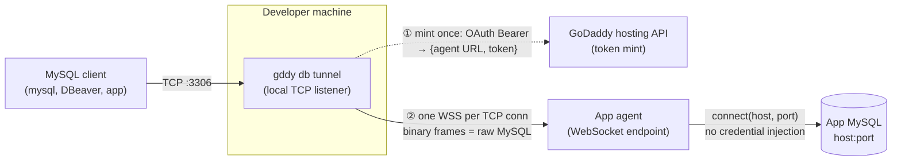

# Proposal: `gddy db tunnel` — MySQL access over a WebSocket bridge

Status: draft; implemented behind an experimental feature flag, seeking review
alongside the server-side changes it depends on.

## Motivation

Developers and support staff sometimes need to point an ordinary MySQL client
(`mysql`, DBeaver, an app's ORM) at the database behind a GoDaddy-hosted
application — to inspect data, run a migration, or debug an issue. There is no
first-class way to do that from `gddy` today.

`gddy db tunnel` opens a local TCP port and, for each client connection, bridges
raw MySQL bytes over a single WebSocket to the application's per-app **agent**,
which dials the app's own database. The tunnel is a byte pump: it never parses
the MySQL protocol and never injects or inspects credentials, so MySQL
authentication and TLS are negotiated **end-to-end** between the client and the
real database, exactly as they would be for a direct connection.

## How it works

There are two planes:

- **Control plane** — a single, out-of-band HTTPS call the CLI makes to the
  GoDaddy hosting API to obtain a short-lived, app-scoped token and the URL of
  the app's agent. This happens once, when the command starts.
- **Data plane** — the byte relay. For each local TCP connection the CLI opens
  one WebSocket to the agent and pumps raw MySQL bytes in both directions. No
  database traffic ever touches the hosting API.



Key properties, all enforced in code:

- **One WebSocket per TCP connection.** No multiplexing, no session resumption.
  When either end closes, the other is closed.
- **Binary frames carry raw MySQL bytes**, verbatim in both directions. Neither
  side understands the MySQL wire protocol.
- **Host and port only.** The agent resolves the database's network location
  from the app's own configuration and dials it. It never places a username,
  password, or connection string into the byte stream — the client completes
  the MySQL handshake, including auth and TLS, directly against the database.
- **The mint and the relay use different paths.** The one-time token mint is an
  ordinary HTTPS API call; the MySQL bytes flow only over the WebSocket to the
  agent. No MySQL bytes ever transit the hosting API.

## Command surface

`gddy db tunnel` is a streaming command
(`RuntimeCommandSpec::new_typed_streaming`) at tier `Mutate`. Flags:

| Flag | Required | Default | Purpose |
| --- | --- | --- | --- |
| `--app-id <APP_ID>` | yes | — | The application/site to tunnel to. The CLI mints a token for this app and connects to its assigned agent. |
| `--port <PORT>` | no | `3306` | Local TCP port MySQL clients connect to. |
| `--listen-host <HOST>` | no | `127.0.0.1` | Local interface to bind. |

The command authenticates with the CLI's own GoDaddy OAuth credential, stepped
up to the same scope that publishing a hosting deployment requires. It first
asks the hosting API for the app's assigned agent URL and a short-lived token,
then opens the tunnel to that URL, presenting the token as
`Authorization: Bearer`. Neither the agent URL nor the token is a user-supplied
flag — both come from the service, so there is nothing to paste and no endpoint
to wire up by hand.

```console
$ gddy db tunnel --app-id <app-id>
# then, in another shell:
$ mysql -h 127.0.0.1 -P 3306 -u <user> -p
```

### Input validation and URL derivation

`--app-id` is validated by `validate_app_id` at the very top of the command,
**before** the mint call — it is interpolated into both the token-request path
and the WebSocket route, so anything that could alter URL structure (`/`, `#`,
`?`, `%`, whitespace) is rejected up front rather than silently misrouting the
request to a confusing `404`/`405`. App ids are short slugs, so the allowlist is
ASCII letters, digits, `-` and `_`.

`build_tunnel_ws_url(agent_url, app_id)` then turns the agent URL returned by the
mint call into the WebSocket URL for the tunnel:

- `http` → `ws`, `https` → `wss`, `ws`/`wss` preserved; any other scheme is
  rejected.
- Only scheme + host:port are taken from the returned URL; any path is discarded
  and replaced with the fixed tunnel route.
- It re-runs `validate_app_id` (defense in depth).

Validation and URL derivation both happen before a port is bound, so a bad
`--app-id` or a malformed agent URL fails fast — with a single terminal error
line — before any client is accepted.

### Relay

Per accepted connection, `handle_connection` sets `TCP_NODELAY`, opens one agent
WebSocket (`connect_agent`, attaching the minted token as
`Authorization: Bearer`), and calls `relay`. `relay` runs **each direction as
its own future**, joined by a final `select!` that returns as soon as either
side ends:

- **Upstream** (client → agent) owns the WebSocket sink: it reads up to 64 KiB
  from the TCP socket and sends one binary message, and on client EOF sends a
  close frame (`client-closed`). Because it owns the sink, it also runs the
  **10-second flush tick** that pushes out auto-queued pong replies while the
  link is idle (the agent pings roughly every 30s and drops the tunnel on a
  missed pong).
- **Downstream** (agent → client) owns the TCP write half: it writes binary
  payloads, treats close/EOF as an agent-side close, ignores non-binary frames,
  and maps a stream error to an error close.

Running the two directions as separate futures is a deliberate correctness
choice: a single `select!` loop that awaited `send`/`write_all` **inline** would,
under simultaneous bidirectional backpressure, suspend the whole loop on one
direction's blocked write and stop draining the other — deadlocking the
connection and starving the keepalive flush. Byte counters are shared
`AtomicU64`s incremented **only after** a successful forward, so the reported
`bytesUp`/`bytesDown` never include a chunk that failed to reach the far side.
`relay` returns `(bytes_up, bytes_down, reason)`.

The 64 KiB upstream chunk keeps outbound frames small; MySQL reassembles its own
packets from the byte stream regardless of framing. In the other direction,
`connect_agent` raises tungstenite's inbound frame limit from its 16 MiB default
to the agent's **32 MiB** cap (`connect_async_with_config`), so a large
downstream result frame is not rejected mid-query.

### Events

Progress is streamed as JSON events: an `authorize` step (`started`/`completed`)
around the token mint, `listening` (bound address, agent URL, app id), a `hint`
with the `mysql -h …` line, `connection` events (`open`/`close`/`error`, with
per-connection byte counts and a close reason), a `warning` on a failed
`accept`, a `shutdown` step on Ctrl-C, and a terminal `result` carrying the app
id and total accepted connections. Terminal errors reuse
`cli_engine::build_error_envelope` via `tunnel_error_event`, so `code`,
`message`, and `fix` match what a non-streaming command would render.
`map_ws_err` turns handshake failures into status-aware fixes
(401/403/404/429/503).

### Feature gating

The `db` module is registered with
`.with_feature_flag("db", Stage::Experimental)`, so it is **hidden at the global
`Stage::Ga` default** and revealed only in an environment whose resolved
`min_stage` is `experimental`. A test in `main.rs`
(`db_tunnel_is_gated_and_exposes_its_flags_when_revealed`) guards both halves:
hidden at GA, and — once revealed — `db tunnel --help` lists every flag.

### Dependencies

`tokio-tungstenite` (rustls, webpki roots — no native-tls) for the WebSocket
client, and `futures-util` (`std`, `sink`) for the split sink/stream. `bytes`
and `url` were already present.

## Authentication and authorization

The CLI never handles a raw agent token as user input. It authenticates the
*mint call* with its own GoDaddy OAuth credential; the hosting platform performs
the identity exchange server-side and hands back a short-lived, app-scoped token
that the CLI simply presents to the agent.

Authorization is checked in depth:

1. **OAuth scope at the mint endpoint.** The mint call requires the same OAuth
   scope that publishing a hosting deployment does, and is rate-limited. An
   unauthenticated or under-scoped caller never reaches the mint logic.
2. **App ownership at the hosting API.** The app is resolved scoped to the
   authenticated customer; an app the caller does not own is not found, and the
   request fails **before** any token is minted.
3. **App ownership again at the agent.** On the WebSocket upgrade the agent
   re-validates the token and requires that the app the token is scoped to
   matches the app in the connection path, so a valid token for one app cannot
   open a tunnel to another.

Beneath all of that, **MySQL's own authentication and TLS run end-to-end** and
are never short-circuited: the tunnel carries opaque bytes, so
`require_secure_transport=ON` and normal user/password/`GRANT` checks apply
exactly as they would for a direct connection.

### The CLI holds only its OAuth credential

The CLI holds only its GoDaddy **OAuth2 access token**. It never mints, parses,
stores, or pastes the app-scoped token the tunnel uses; it receives that token
from the hosting API at mint time and holds it in memory only for the lifetime
of the tunnel. Because the identity exchange and token signing are entirely
server-side, changing how the token is minted — including tightening its scope
later — needs **no CLI change**.

## Security model

- **No credential injection anywhere in the path.** The agent knows the DB host
  and port and dials them; it never writes credentials into the relayed stream.
  The MySQL client authenticates directly against the database, so end-to-end
  MySQL auth and TLS (including `require_secure_transport=ON`) are preserved.
- **The destination is pinned server-side.** The client supplies no target host
  — only `--app-id`. The agent derives the DB target from the app's own
  configuration, so there is no SSRF surface.
- **Ownership is enforced in depth**, not just at the edge: an OAuth scope gate
  and a customer-scoped app lookup before a token is minted, and a
  token-vs-path app check at the agent before it dials.
- **The token is minted per-run and never persisted.** The CLI requests a
  short-lived token when the command starts and holds it only in memory for the
  lifetime of the tunnel; there is nothing to paste, store, or rotate by hand.
- **Blast-radius limits.** The mint endpoint is rate-limited; the agent bounds
  idle and total connection duration, caps concurrent tunnels per app and in
  total, and enforces a bounded per-frame size.
- **Logging hygiene.** Both the CLI and the agent emit connection-level metrics
  (byte counts, duration, host/port, close reason) and never log payload bytes
  or credentials.

## Design decisions and rationale

- **WebSocket to the app's agent, not a new proxy.** The agent already
  terminates authenticated HTTP requests and sits inside the app-runtime network
  with a route to the database. Riding the HTTP `upgrade` path reuses that edge
  and those auth primitives without exposing a new public port.
- **Relay at the agent.** The agent is the only component that simultaneously
  knows the app's DB host:port, has a network route to it, and already enforces
  app ownership. Relaying anywhere else would duplicate DB-config resolution and
  ownership checks.
- **Raw byte relay, no MySQL parsing.** Preserving end-to-end MySQL auth and TLS
  keeps the DB credential story unchanged, avoids a MySQL-protocol parser as
  attack surface, and keeps the tunnel protocol-agnostic.
- **Destination pinned by `--app-id`.** The client cannot ask the agent to dial
  an arbitrary host, which removes the SSRF surface.
- **One WebSocket per TCP connection.** MySQL connections are independent; tying
  each to its own WS keeps lifecycle trivial (close one, close the other) and
  avoids multiplexing/head-of-line complexity.
- **Server-side mint that also returns the agent URL.** Keeps the app-scoped
  token's signing authority server-side, reuses the platform's existing mint
  primitive, and gives the CLI a one-command UX with nothing to paste.
- **Reuse the deployment scope.** Tunneling to an app's DB is a comparable level
  of access to publishing a deployment, so no new OAuth scope needs to be
  provisioned.
- **Ships gated off.** The CLI command is hidden at the GA default and revealed
  only in experimental environments, and the server side is dark-launched, so
  the feature can land and be validated without exposure.

## Cross-team dependencies

`gddy db tunnel` is the client half of a change that also needs two server-side
pieces, each tracked in its own repository and PR:

- **A hosting-API endpoint** that, given an app the caller owns, mints a
  short-lived, app-scoped token and returns the app's agent URL in one call.
- **An agent-side WebSocket handler** that authenticates that token, re-checks
  app ownership, dials the app's database, and relays raw bytes.

Both ship gated off by default, so the CLI command can be revealed independently
once the server pieces are enabled in a given environment.

## Deferred work

- **Token lifetime.** The token is minted once when the command starts and
  reused for every WebSocket for the tunnel's lifetime (the mint response's
  expiry is not yet consumed). A tunnel left open past the token's TTL keeps
  serving its existing connections, but a *new* MySQL connection opened after
  expiry fails the agent handshake with `401` and the command must be restarted.
  Pre-emptive re-mint on expiry is a deliberate follow-up.
- **Full-path verification.** The CLI relay and URL/error mapping are
  unit-tested, and the tunnel has been exercised end-to-end against the agent
  handler in isolation. A run through the deployed mint endpoint and the
  production agent edge is the remaining validation step.

## Testing

- **CLI unit tests** (`rust/src/db/tunnel.rs`): `build_tunnel_ws_url` for
  http→ws / https→wss, scheme preservation, path replacement, and rejection of
  bad schemes, missing hosts, and bad app ids — including a case that rejects
  URL-metacharacter app ids (`#`, `?`, `%`, whitespace, `.`, `:`) before they
  reach any request path; plus `tunnel_error_event` carrying
  `code`/`message`/`fix`.
- **CLI client test** (`rust/src/hosting/nodejs/client.rs`): the mint call
  (`get_agent_token`) POSTs with bearer auth and parses `{ agentUrl, token }`
  from the response.
- **CLI gating test** (`rust/src/main.rs`): `db` hidden at the GA default and,
  once revealed, `db tunnel --help` exposing its `--app-id`, `--port`, and
  `--listen-host` flags.
